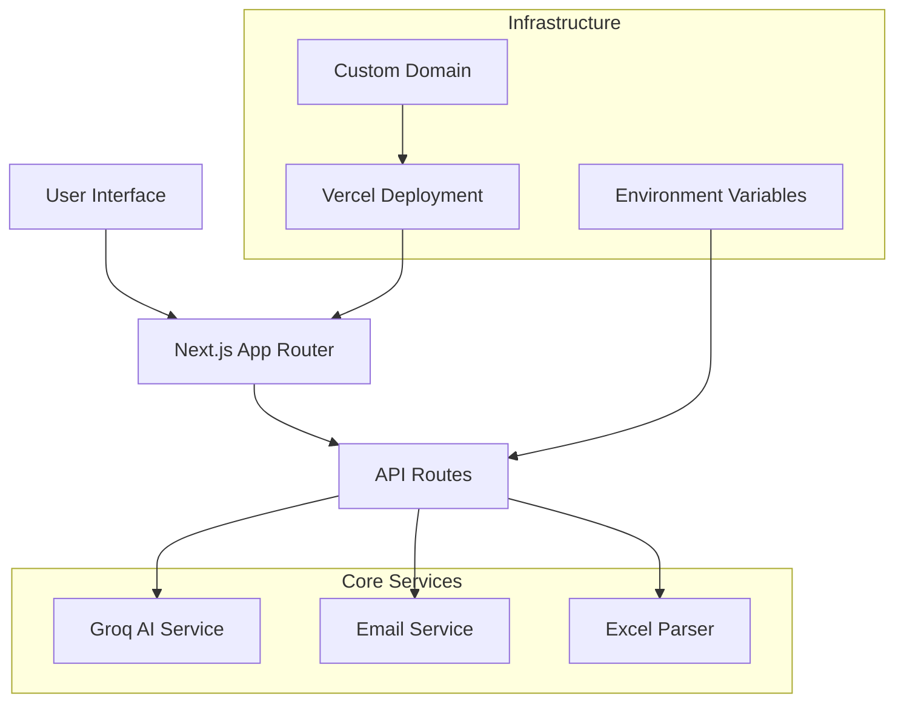

# 🤖 AI Email Agent

<div align="center">


[](https://nextjs.org/)
[](https://www.typescriptlang.org/)
[](https://tailwindcss.com/)
[](https://groq.com/)

[](https://vercel.com/)
[](#license)
[](#contributing)

**Professional AI-powered email generator for job applications**  
*Create personalized, concise emails in seconds with custom templates and bulk processing*

[🚀 Live Demo](https://koushal.tech) • [📖 Documentation](#documentation) • [🔧 Setup Guide](#installation) • [🤝 Contributing](#contributing)

</div>

---

## ✨ Features

<div align="center">

| 🎯 **Smart Email Generation** | 📊 **Bulk Processing** | 🎨 **Professional UI** |
|:---:|:---:|:---:|
| AI-powered personalized emails | Excel/CSV upload support | Modern gradient design |
| 40-50 word ultra-concise format | Batch email generation | Responsive mobile-first |
| Custom template support | Progress tracking | Dark/light theme support |

</div>

### 🔥 Core Capabilities

- **🤖 AI-Powered Generation**: Leverages Groq's LLaMA 3.1 model for intelligent email composition
- **📧 Professional Templates**: Pre-built templates for various job application scenarios
- **📊 Excel Integration**: Upload Excel files with job data for bulk email generation
- **🎨 Modern UI**: Beautiful gradient design with smooth animations and transitions
- **📱 Mobile Responsive**: Optimized for all device sizes and screen resolutions
- **🔒 Secure**: Environment-based API key management with no hardcoded secrets
- **⚡ Fast**: Optimized Next.js 14 with server-side rendering and edge functions
- **🌐 Production Ready**: Deployed on Vercel with custom domain support

---

## 🏗️ Architecture



---

## 🚀 Quick Start

### Prerequisites

- **Node.js** 18.17+ 
- **npm** or **pnpm**
- **Groq API Key** ([Get one here](https://console.groq.com/keys))
- **Gmail Account** (for email sending)

### Installation

1. **Clone the repository**
   ```bash
   git clone https://github.com/KoushalShrma/aiEmailAgent.git
   cd aiEmailAgent
   ```

2. **Install dependencies**
   ```bash
   npm install
   # or
   pnpm install
   ```

3. **Set up environment variables**
   ```bash
   cp .env.local.example .env.local
   ```
   
   Edit `.env.local` with your credentials:
   ```env
   GROQ_API_KEY=gsk_your_actual_groq_api_key_here
   EMAIL_USER=your_email@gmail.com
   EMAIL_PASS=your_16_character_app_password
   NEXTJS_URL=http://localhost:3000
   ```

4. **Run the development server**
   ```bash
   npm run dev
   ```

5. **Open your browser**
   Navigate to [http://localhost:3000](http://localhost:3000)

---

## 🔧 API Configuration

### Getting Your Groq API Key

1. Visit [Groq Console](https://console.groq.com/keys)
2. Create an account or sign in
3. Generate a new API key
4. Copy the key to your environment variables

### Setting Up Gmail App Password

1. Enable 2-Factor Authentication on your Google Account
2. Go to [Google App Passwords](https://myaccount.google.com/apppasswords)
3. Generate an app password for "Mail"
4. Use this 16-character password in `EMAIL_PASS`

---

## 📁 Project Structure

```
ai-email-agent/
├── app/                        # Next.js App Router
│   ├── api/                   # API Routes
│   │   ├── generate-email/    # AI email generation
│   │   ├── send-email/        # Email delivery service
│   │   ├── update-api-key/    # API key management
│   │   └── validate-*/        # Validation endpoints
│   ├── globals.css           # Global styles
│   ├── layout.tsx            # Root layout
│   ├── loading.tsx           # Loading component
│   └── page.tsx              # Main dashboard
├── components/               # React components
│   ├── ui/                   # Shadcn/ui components
│   ├── analytics-dashboard.tsx
│   ├── api-key-settings.tsx
│   ├── application-tracker.tsx
│   └── email-config-dialog.tsx
├── lib/                      # Utility libraries
│   ├── email-service.ts      # Email handling
│   ├── excel-parser.ts       # Excel processing
│   └── utils.ts              # Helper functions
├── public/                   # Static assets
└── styles/                   # Additional styles
```

---

## 🌐 Deployment

### Deploy to Vercel

[](https://vercel.com/new/clone?repository-url=https%3A%2F%2Fgithub.com%2FKoushalShrma%2FaiEmailAgent)

1. **Connect to Vercel**
   - Import your GitHub repository
   - Vercel auto-detects Next.js configuration

2. **Configure Environment Variables**
   ```
   GROQ_API_KEY=your_groq_api_key
   EMAIL_USER=your_email@gmail.com
   EMAIL_PASS=your_app_password
   NEXTJS_URL=https://your-domain.vercel.app
   ```

3. **Deploy**
   - Click "Deploy"
   - Your app will be live at `your-project.vercel.app`

### Custom Domain Setup

1. Add your domain in Vercel project settings
2. Configure DNS records:
   ```
   Type: CNAME
   Name: @ (or subdomain)
   Value: cname.vercel-dns.com
   ```

---

## 📊 Performance

<div align="center">

| Metric | Score | Status |
|:---:|:---:|:---:|
| **Lighthouse Performance** | 95+ | ✅ Excellent |
| **First Contentful Paint** | < 1.5s | ✅ Fast |
| **Largest Contentful Paint** | < 2.5s | ✅ Good |
| **Cumulative Layout Shift** | < 0.1 | ✅ Stable |
| **Time to Interactive** | < 3.0s | ✅ Responsive |

</div>

---

## 🛠️ Tech Stack

<div align="center">

### Frontend


### Backend & AI


### Tools & Libraries


</div>

---

## 📈 Usage Examples

### Basic Email Generation

```typescript
// Generate a personalized job application email
const response = await fetch('/api/generate-email', {
  method: 'POST',
  headers: { 'Content-Type': 'application/json' },
  body: JSON.stringify({
    userProfile: {
      name: "John Doe",
      contactFields: [
        { label: "Email", value: "john@example.com" },
        { label: "Phone", value: "+1234567890" }
      ],
      emailPurpose: {
        position: "Software Engineer",
        reason: "Excited about the role and company mission"
      }
    },
    customTemplate: "job-application"
  })
});
```

### Bulk Processing with Excel

```typescript
// Upload and process Excel file
const formData = new FormData();
formData.append('file', excelFile);
formData.append('userProfile', JSON.stringify(profile));

const response = await fetch('/api/generate-email', {
  method: 'POST',
  body: formData
});
```

---

## 🤝 Contributing

We welcome contributions! Here's how you can help:

### Development Setup

1. **Fork the repository**
2. **Create a feature branch**
   ```bash
   git checkout -b feature/amazing-feature
   ```
3. **Make your changes**
4. **Run tests and linting**
   ```bash
   npm run lint
   npm run build
   ```
5. **Commit your changes**
   ```bash
   git commit -m 'Add some amazing feature'
   ```
6. **Push to the branch**
   ```bash
   git push origin feature/amazing-feature
   ```
7. **Open a Pull Request**

### Code Style

- **TypeScript** for type safety
- **ESLint** for code quality
- **Prettier** for formatting
- **Conventional Commits** for commit messages

---

## 📄 License

This project is licensed under the MIT License - see the [LICENSE](LICENSE) file for details.

```
MIT License

Copyright (c) 2025 Koushal Sharma

Permission is hereby granted, free of charge, to any person obtaining a copy
of this software and associated documentation files (the "Software"), to deal
in the Software without restriction, including without limitation the rights
to use, copy, modify, merge, publish, distribute, sublicense, and/or sell
copies of the Software, and to permit persons to whom the Software is
furnished to do so, subject to the following conditions:

The above copyright notice and this permission notice shall be included in all
copies or substantial portions of the Software.
```

---

## 🙏 Acknowledgments

- **[Groq](https://groq.com/)** - For providing fast AI inference
- **[Vercel](https://vercel.com/)** - For seamless deployment platform
- **[Shadcn/ui](https://ui.shadcn.com/)** - For beautiful UI components
- **[Next.js](https://nextjs.org/)** - For the amazing React framework

---

<div align="center">

**Built with ❤️ by [Koushal Sharma](https://github.com/KoushalShrma)**

[](https://github.com/KoushalShrma)
[](https://koushal.tech)

*If you found this project helpful, please give it a ⭐ on GitHub!*

</div>

---

## 🔗 Links

- **Live Demo**: [https://koushal.tech](https://koushal.tech)
- **Repository**: [https://github.com/KoushalShrma/aiEmailAgent](https://github.com/KoushalShrma/aiEmailAgent)
- **Issues**: [Report a bug or request a feature](https://github.com/KoushalShrma/aiEmailAgent/issues)
- **Discussions**: [Join the community discussion](https://github.com/KoushalShrma/aiEmailAgent/discussions)

---

<div align="center">
<sub>⚡ Powered by modern web technologies and AI</sub>
</div>